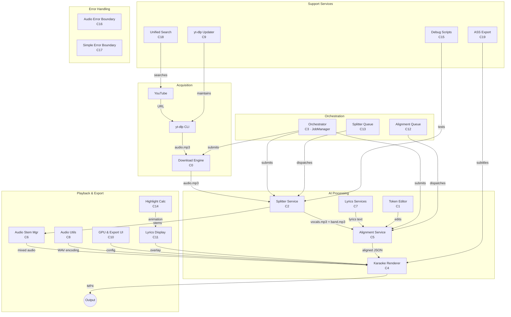

# Architecture at a Glance (Deep Mode)

KaraokeBox is a full-stack desktop application that downloads songs from YouTube, separates vocals from instrumentals using AI, syncs lyrics, and renders karaoke videos for export. Think of it as a **recording studio in a box** — it handles everything from acquiring raw audio to producing a finished karaoke video.

## System Architecture



## Architectural Patterns

| Pattern | Implementation | Where |
|---------|---------------|-------|
| **Adapter** | Splitter/download adapters share interface | `server/splitter/*adapter.js` |
| **Strategy** | EngineManager picks download engine | `server/downloader/engine-manager.js` |
| **Smart Router** | `initSplitterService()` routes by model | `server/splitter/index.js` |
| **Job Queue** | SQLite-backed JobManager | `server/orchestrator/index.js` |
| **Observer** | Progress callbacks on all jobs | All queue modules |

## Cross-Cutting Concerns

| Concern | How Addressed |
|---------|---------------|
| Stem Alignment | 44.1kHz WAV canonicalization before ALL separation |
| GPU/CPU Fallback | Automatic CUDA → CPU in Demucs + UVR |
| Windows Spawning | `run_audio_separator.py` avoids pip .exe fragility |
| venv Isolation | All Python deps in `venv/`, wrapper survives rebuilds |

## Pipeline Data Flow

```
┌──────────┐   audio.mp3   ┌──────────┐  stems  ┌──────────┐  aligned JSON  ┌──────────┐
│ Download │──────────────▶│  Split   │───────▶│  Align   │──────────────▶│  Render  │──▶ MP4
│  Engine  │               │ Service  │        │ Service  │               │  Engine  │
│   (C0)   │               │   (C2)   │        │   (C5)   │               │   (C4)   │
└──────────┘               └──────────┘        └──────────┘               └──────────┘
      ▲                         ▲                    ▲                          ▲
      │                         │                    │                          │
      │    ┌──────────┐         │    ┌──────────┐    │          ┌──────────┐    │
      └────│Orchestrtr│─────────┘    │  Lyrics  │────┘          │  Audio   │────┘
           │  (C3)    │              │ Services │               │  Utils   │
           └──────────┘              │   (C7)   │               │   (C8)   │
                                     └──────────┘               └──────────┘
```

## Core Systems

| System | Community | Nodes | Role |
|--------|-----------|-------|------|
| Download Engine | C0 | 39 | YouTube → MP3 acquisition |
| Lyrics Token Editor | C1 | 37 | Word-level timing editor with undo |
| Vocal Splitter | C2 | 33 | AI stem separation (Demucs + UVR-MDX-NET) |
| Orchestrator | C3 | 31 | Central job coordinator (SQLite) |
| Karaoke Renderer | C4 | 23 | WebGL frame rendering → MP4 |
| Audio Alignment | C5 | 22 | AudioShake lyrics-to-audio sync |
| Audio Stem Manager | C6 | 21 | Multi-track sync playback |
| Lyrics Services | C7 | 16 | Genius + AzLyrics scrapers |
| Audio Utilities | C8 | 16 | WAV encoding, sample clamping |

**Total:** 407 nodes · 516 edges · 64 communities · 0% EXTRACTED · 47 INFERRED edges
