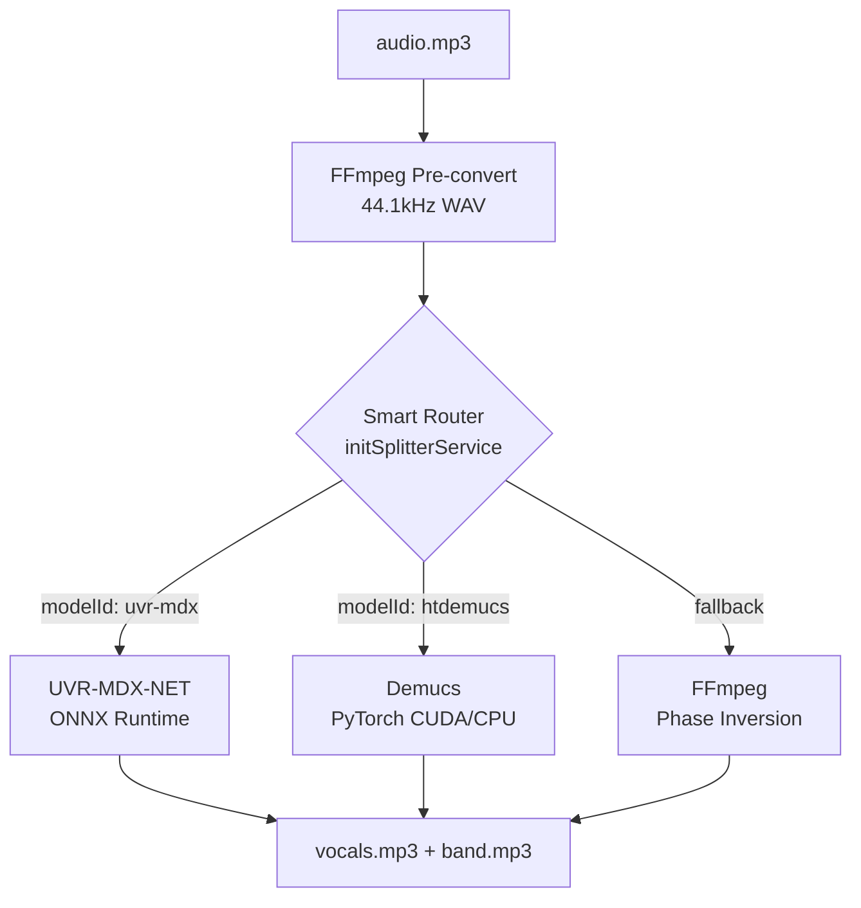

# Vocal Splitter Service

> **33 nodes** | **Cohesion: 0.06** (loose) | **Files:** `index.js`, `demucs-adapter.js`, `uvr-mdx-net-adapter.js`, `audio-separator-adapter.js`, `ffmpeg-splitter-adapter.js`, `mock-adapter.js`, `run_audio_separator.py`

## For Humans

**Real-world analogy:** This is the **mixing engineer at a recording studio**. You hand them a full song (vocals + instruments mixed together), and they separate it into individual tracks — the singer on one channel, the band on another. They have multiple techniques: AI models (Demucs, UVR-MDX-NET), phase cancellation (FFmpeg), and even a mock engineer for practice runs.

### Architecture



```
┌──────────────────────────────────────────────────┐
│              initSplitterService()                │
│              ┌──────────────────┐                │
│              │  Health Check     │                │
│              │  Demucs: ✓        │                │
│              │  UVR-MDX-NET: ✓   │                │
│              └──────┬───────────┘                │
│                     │                             │
│    ┌────────────────┼────────────────┐            │
│    ▼                ▼                ▼            │
│  ┌────────┐   ┌──────────┐   ┌───────────┐      │
│  │Demucs  │   │UVR-MDX   │   │ FFmpeg    │      │
│  │Adapter │   │NET Adptr │   │ Adapter   │      │
│  │        │   │          │   │           │      │
│  │python  │   │python    │   │ ffmpeg    │      │
│  │-m      │   │run_audio_│   │ -i -filter│      │
│  │demucs  │   │separator │   │_complex   │      │
│  │--two-  │   │.py       │   │           │      │
│  │stems   │   │          │   │           │      │
│  └───┬────┘   └────┬─────┘   └─────┬─────┘      │
│      │             │               │             │
│      ▼             ▼               ▼             │
│  ┌──────────────────────────────────────┐        │
│  │        ┌──────────────┐              │        │
│  │        │  MockAdapter │ (dev only)   │        │
│  │        └──────────────┘              │        │
│  └──────────────────────────────────────┘        │
└──────────────────────────────────────────────────┘
```

### Key Nodes

| Node | Role |
|------|------|
| **initSplitterService()** | Health-checks adapters, sets Smart Router processor |
| **DemucsAdapter** | Hybrid Transformer Demucs (htdemucs). GPU-capable. 2 or 4 stems |
| **UVRMDXNetAdapter** | Ultimate Vocal Remover MDX-NET. Best for instrument separation |
| **FFmpegSplitterAdapter** | Phase inversion (subtract channels) — no AI needed |
| **MockSplitterAdapter** | Returns simulated stems for UI testing |
| **run_audio_separator.py** | Wrapper script (avoids Windows pip .exe spawn bugs) |

### Cohesion: 0.06 (loose)
Each adapter is independent — they share only the interface contract. This is *good* design: you can swap adapters without touching others.

### Bridges
- **Orchestrator (C3):** JobManager submits split jobs
- **Splitter Queue (C13):** Manages job lifecycle
- **Download Engine (C0):** Provides input audio.mp3

## For LLMs

- **ID:** 2 · **Size:** 33 · **Cohesion:** 0.06 · **Pattern:** Adapter Family
- **Files:** `server/splitter/index.js`, `demucs-adapter.js`, `uvr-mdx-net-adapter.js`, `audio-separator-adapter.js`, `ffmpeg-splitter-adapter.js`, `mock-adapter.js`, `run_audio_separator.py`
- **Top nodes:** index.js(8), DemucsAdapter(7), UVRMDXNetAdapter(5), MockSplitterAdapter(5), FFmpegSplitterAdapter(5)
