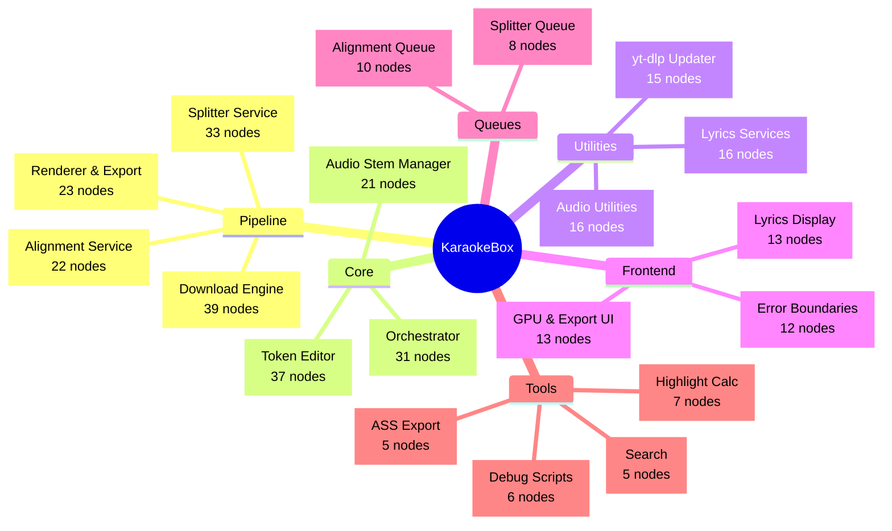
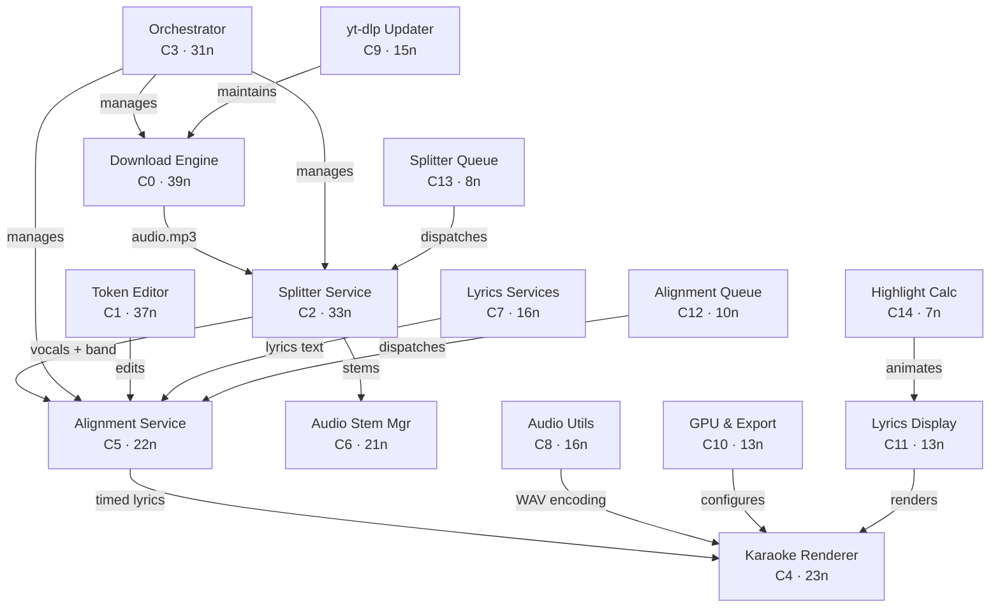

# Top Communities

> Top 20 communities by size.  407 nodes · 64 communities total.

| # | Community | Nodes | Cohesion | Character |
|---|-----------|-------|----------|-----------|
| 0 | [[COMMUNITY_0|Download Engine]] | 39 | 0.06 loose | Adapter Chain |
| 1 | [[COMMUNITY_1|Lyrics Token Editor]] | 37 | 0.13 loose | Immutable Transforms |
| 2 | [[COMMUNITY_2|Vocal Splitter Service]] | 33 | 0.06 loose | Adapter Family |
| 3 | [[COMMUNITY_3|Orchestrator & Job Manager]] | 31 | 0.08 loose | Central Coordinator |
| 4 | [[COMMUNITY_4|Karaoke Renderer & Export]] | 23 | 0.17 moderate | WebGL Pipeline |
| 5 | [[COMMUNITY_5|Audio Alignment Service]] | 22 | 0.12 loose | API Gateway |
| 6 | [[COMMUNITY_6|Audio Stem Manager]] | 21 | 0.00 single-class | Multi-track Mixer |
| 7 | [[COMMUNITY_7|Lyrics Services]] | 16 | 0.25 moderate | Web Scrapers |
| 8 | [[COMMUNITY_8|Audio Utilities]] | 16 | 0.17 moderate | Pure Functions |
| 9 | [[COMMUNITY_9|yt-dlp Updater]] | 15 | 0.24 moderate | CLI Wrapper |
| 10 | [[COMMUNITY_10|GPU & Export UI]] | 13 | 0.19 moderate | React Hook |
| 11 | [[COMMUNITY_11|Lyrics Display]] | 13 | 0.23 moderate | Pagination |
| 12 | [[COMMUNITY_12|Alignment Job Queue]] | 10 | 0.00 single-class | FIFO Queue |
| 13 | [[COMMUNITY_13|Splitter Job Queue]] | 8 | 0.00 single-class | FIFO Queue |
| 14 | [[COMMUNITY_14|Word Highlight Calculator]] | 7 | 0.00 single-class | Timing Math |
| 15 | [[COMMUNITY_15|Debug Separator Script]] | 6 | 0.60 tight | Dev Tool |
| 16 | [[COMMUNITY_16|Audio Error Boundary]] | 6 | 0.00 single-class | React Safety Net |
| 17 | [[COMMUNITY_17|Simple Error Boundary]] | 6 | 0.00 single-class | React Safety Net |
| 18 | [[COMMUNITY_18|Unified Search]] | 5 | 0.00 single-class | Search Aggregator |
| 19 | [[COMMUNITY_19|ASS Subtitle Export]] | 5 | 0.70 tight | Format Converter |

**Cohesion guide:** 0.0–0.15 loose / 0.15–0.30 moderate / 0.30–0.50 coherent / 0.50+ tight

## How Communities Connect

